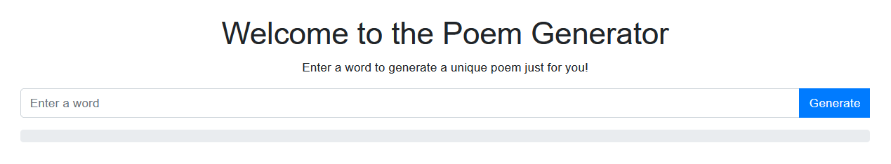

Конечно, вот пример содержимого README файла для вашего проекта:

# Poem Generator

Этот проект представляет собой сайт, который генерирует поэмы с использованием API GigaChat от сбербанка. Проект написан на Node js.

## Зависимости

Проект использует следующие зависимости:

- express: 4.19.2
- express-handlebars: 7.1.2
- express-session: 1.18.0
- multer: 1.4.5-lts.1
- node-fetch: 2.6.6
- sqlite3: 5.1.7

## Использование API GigaChat

Для использования API GigaChat необходимо получить доступ к нему, зарегистрировавшись на их [сайте](https://developers.sber.ru/gigachat/login), после этого нужно заменить переменные в файле gigachat_requests.js:
- const CREDENTIALS = 'YOUR_CREDENTIALS_HERE';
- const SECRET = 'YOUR_SECRET_HERE';

## Установка и запуск

1. Установите зависимости с помощью команды npm install.
2. Запустите сервер с помощью команды node main.js.

